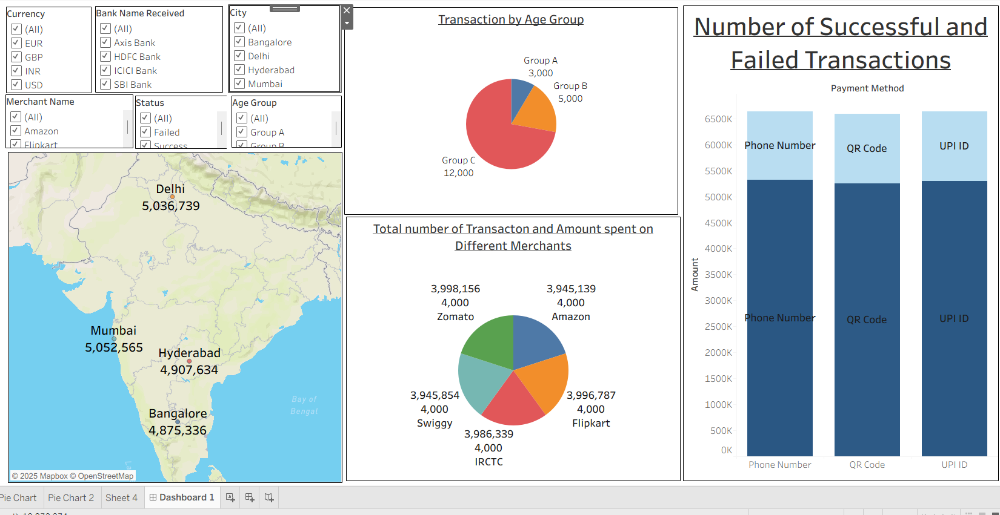

# 📈 Tableau Project – Dashboard 2: Market Trends & Insights

## 📝 Project Overview
This Tableau dashboard presents insights into market trends, customer behavior, and product performance. The report offers a visually rich interface to explore high-level patterns and granular data across multiple dimensions.

## 📁 Files Included
- `Tableau Dashboard 2.twbx` – Packaged Tableau workbook with data and visualizations
- *(Optional)* `market_data.xlsx` – Raw data file (optional)
- `dashboard2_screenshot.png` – Screenshot preview of the dashboard

## 📌 Key Features
- Trend analysis of sales and customer activity  
- Segmentation by demographics, product category, or location  
- Dynamic visual elements: maps, bars, heat maps  
- Filterable views for custom analysis

## 🔧 Tools & Techniques Used
- Tableau Desktop  
- Parameters, calculated fields, filters  
- Interactive visualization elements  
- Responsive dashboard layout

## 📸 Dashboard Screenshot

