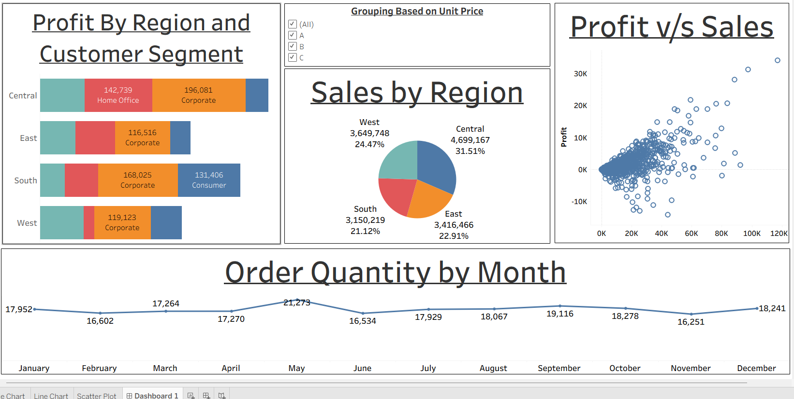

# 📊 Tableau Project – Dashboard 1: Business Performance Overview

## 📝 Project Overview
This Tableau dashboard provides a comprehensive overview of key business performance metrics. It visualizes KPIs across time, regions, and categories to help stakeholders monitor growth and identify areas for improvement.

## 📁 Files Included
- `Tableau Dashboard 1.twbx` – Packaged Tableau workbook containing all visualizations
- *(Optional)* `data_source.xlsx` – Raw dataset used (if shareable)
- `dashboard1_screenshot.png` – Visual preview (recommended)

## 📌 Key Features
- Time-series analysis of revenue and customer trends  
- Regional performance breakdown with filters  
- KPI highlights and summary tiles  
- Interactive dashboards with drop-down selectors

## 🔧 Tools & Techniques Used
- Tableau Desktop  
- Calculated fields, parameters, and filters  
- Dashboard and story design  
- Data blending (if applicable)

## 📸 Dashboard Screenshot

